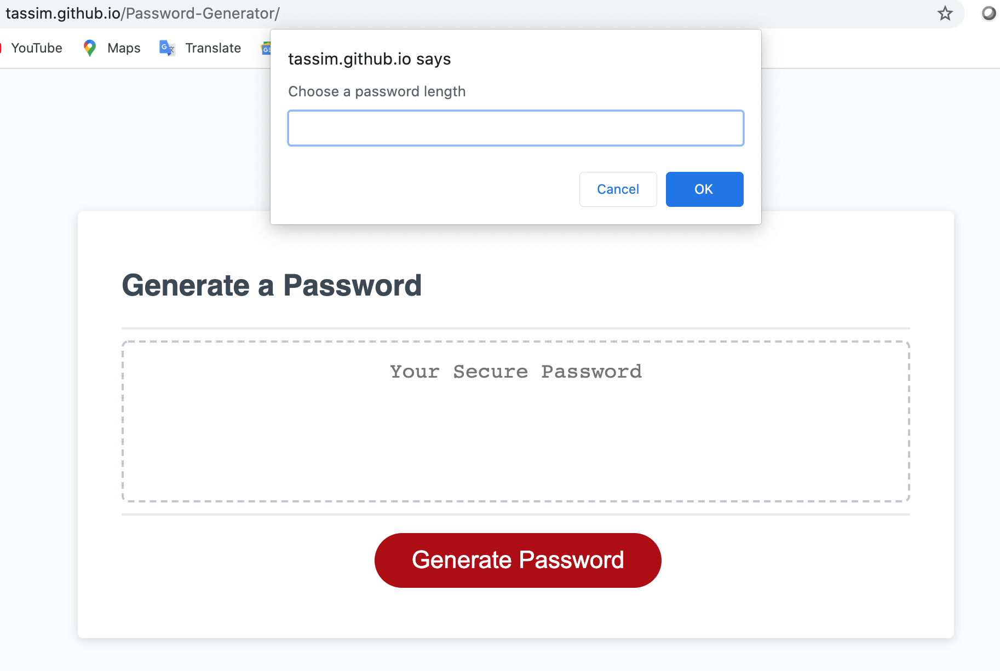

# My Random Password Generator:

Application that creates a random password based on the following selection:
Length between 8 and 128 characters;
Option to include characters such as symbol, numeric, upper case and lower case.

## Comments

This was an assignment from the boot-camp, this was my first time I had to write code in javascript. The requirements were to use prompt and alert. I can still remember the frustration and satisfaction (once everything was working) writing if statements, using addEventListener, for loop among others.

[GitHub](https://tassim.github.io/Password-Generator/)
